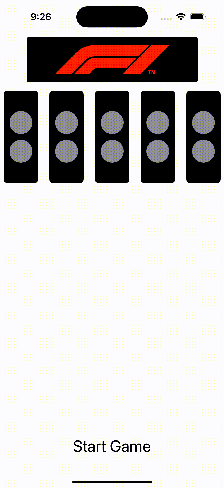

# F1 Reaction Time Game

A simple reaction time game inspired by Formula 1 racing start lights. This app challenges users to react as quickly as possible when the lights go out, simulating the start of a Formula 1 race. Built with SwiftUI and following the MVVM architecture, it showcases countdown lights and measures user reaction time with precision.

## Features

- **Realistic F1 Countdown**: Lights illuminate sequentially from right to left.
- **Reaction Time Measurement**: Measures and displays the user's reaction time once the lights go out.
- **Jump Start Detection**: Detects early taps and shows a "Jump Start" message, encouraging the user to try again.
- **Clean UI**: Minimalist design with a full-width tappable button.

## Demo

<p align="center">
  
</p>

## How to Play

1. Tap "Start Game" to initiate the countdown.
2. Wait for the lights to go out.
3. Tap as soon as possible when the lights go out to record your reaction time.
4. If you tap before the lights go out, you'll see a "Jump Start" message and will need to try again.

## Architecture

This app is built using the MVVM (Model-View-ViewModel) architecture:

- **View** (`ReactionTimeGameView`): The SwiftUI view layer that displays the countdown lights, buttons, and messages.
- **ViewModel** (`ReactionTimeGameViewModel`): Manages game state, countdown logic, and reaction time measurement.
- **Model**: Basic state management handled within the ViewModel for simplicity.

## Installation & Contributing

### Getting Started

1. **Fork the Repository**: Click the "Fork" button at the top right of this page to create a copy of this repository under your GitHub account.

2. **Clone Your Forked Repository**:
   ```bash
   git clone https://github.com/your-username/F1-Reaction-Time-Game.git
   cd F1-Reaction-Time-Game
   ```

3. **Open the Project in Xcode**:
   ```bash
   open F1-Reaction-Time-Game.xcodeproj
   ```

4. **Build and Run**: Build and run the project on an iOS Simulator or device.

### Contributing

We're planning to add a **Leaderboard** feature, allowing users to compete and compare reaction times. Collaboration is highly encouraged!

1. Create a new branch for your feature:
   ```bash
   git checkout -b feature/leaderboard
   ```

2. Make your changes and commit:
   ```bash
   git commit -m "Add leaderboard feature"
   ```

3. Push to your branch:
   ```bash
   git push origin feature/leaderboard
   ```

4. Open a pull request for review.

We welcome contributions to make this project better!

## Requirements

- Xcode 12 or later
- iOS 15 or later

## Future Work

Planned enhancements for the project include adding a **Leaderboard** feature to track and display top reaction times, making the game more competitive and engaging. This feature will allow users to compare their reaction times with others and aim for the top spot.

**Collaboration is highly encouraged**! If you're interested in contributing to this or other features, feel free to fork the repository, make improvements, and open a pull request.

## License

This project is licensed under the MIT License - see the [LICENSE](LICENSE) file for details.
